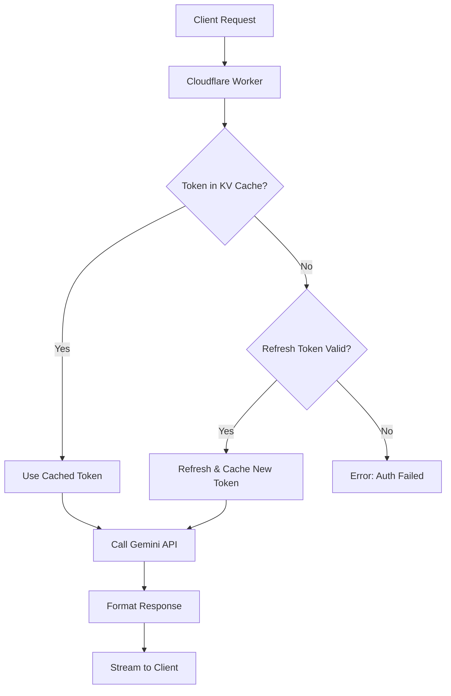

# 🚀 Gemini CLI OpenAI Worker

[](https://www.buymeacoffee.com/mrproper)
[](https://www.star-history.com/#GewoonJaap/gemini-cli-openai&Date)

Transform Google's Gemini models into OpenAI-compatible endpoints using Cloudflare Workers. This project allows you to access Google's state-of-the-art AI models through the familiar OpenAI API, powered by your own Google account's OAuth2 credentials.

## ✨ Features

- 🔐 **Secure Authentication**: Uses your Google account's OAuth2 credentials. No API keys needed.
- 🎯 **OpenAI-Compatible API**: A drop-in replacement for OpenAI's API, compatible with official SDKs and a wide range of tools.
- 🧠 **Advanced Reasoning**: Full control over Gemini's "thinking" capabilities, with support for `openai`, `tagged`, `hidden`, and DeepSeek-compatible `r1` output modes. (`field` is now a legacy alias of `openai`.)
- 🛠️ **Full Tool Support**:
    - **OpenAI-Style Tool Calling**: Define and use your own custom functions.
    - **Native Gemini Tools**: Enable Google Search and other native tools directly.
    - **Mixed-Mode Operation**: Use both native and custom tools in the same request.
- 🖼️ **Vision Support**: Engage in multi-modal conversations with images using base64 or public URLs.
- 🔄 **Smart Model Handling**:
    - **Auto-Switching**: Automatically falls back from Pro to Flash models on rate limit errors.
    - **Full Parameter Support**: Supports standard OpenAI parameters like `seed`, `response_format`, `temperature`, `top_p`, and more.
- 🛡️ **Content Safety**: Configure Gemini's moderation settings to fit your needs.
- 🌐 **Broad Integration**: Works with Open WebUI, Cline, LiteLLM, Dify, and other OpenAI-compatible clients.
- ⚡ **High Performance**: Deployed on Cloudflare's global edge network for low latency.
- 📡 **Real-time Streaming**: Server-sent events (SSE) for live responses, including token usage data.
- 🆓 **Free Tier Access**: Utilizes Google's free tier via the Code Assist API.

## 🤖 Supported Models

The worker supports the latest Gemini models available through the Code Assist API.

| Model ID              | Context Window | Max Output Tokens | Thinking Support | Description                                             |
| --------------------- | -------------- | ----------------- | ---------------- | ------------------------------------------------------- |
| `gemini-2.5-pro`      | 1M             | 65K               | ✅               | Latest Gemini 2.5 Pro model with reasoning capabilities.  |
| `gemini-2.5-flash`    | 1M             | 65K               | ✅               | Fast Gemini 2.5 Flash model with reasoning capabilities.  |
| `gemini-2.5-flash-lite` | 1M             | 65K               | ✅               | Lightweight version of Gemini 2.5 Flash.                |

> **Note on "Thinking"**: All supported models have "thinking" (reasoning) capabilities. You can control this behavior via environment variables and request parameters. See the [Thinking & Reasoning](#-thinking--reasoning) section for details.

## 🔧 Setup Guide

### Prerequisites

1.  A **Google Account** with access to Gemini.
2.  A **Cloudflare Account** with a Workers subscription.
3.  **Wrangler CLI** installed: `npm install -g wrangler`.

### Step 1: Get OAuth2 Credentials

The worker authenticates using OAuth2 credentials from a Google account that has accessed Gemini. The easiest way to obtain these is by using the official Gemini CLI.

1.  **Install Gemini CLI**:
    ```bash
    npm install -g @google/gemini-cli
    ```

2.  **Run the CLI & Authenticate**:
    ```bash
    gemini
    ```
    Select `● Login with Google` and follow the browser prompts to sign in.

3.  **Locate Credentials**: Find the `oauth_creds.json` file created by the CLI.
    -   **Windows**: `C:\Users\USERNAME\.gemini\oauth_creds.json`
    -   **macOS/Linux**: `~/.gemini/oauth_creds.json`

4.  **Copy the JSON content**. It will look like this:
    ```json
    {
      "access_token": "ya29.a0AS3H6Nx...",
      "refresh_token": "1//09FtpJYpxOd...",
      "scope": "https://www.googleapis.com/auth/cloud-platform ...",
      "token_type": "Bearer",
      "id_token": "eyJhbGciOiJSUzI1NiIs...",
      "expiry_date": 1750927763467
    }
    ```

### Step 2: Configure Your Worker

1.  **Clone the Repository**:
    ```bash
    git clone https://github.com/GewoonJaap/gemini-cli-openai.git
    cd gemini-cli-openai
    ```

2.  **Create `.dev.vars` file**: Copy the `dev.vars.example` file to a new file named `.dev.vars` and add your secrets. This file is ignored by Git.

    ```ini
    # .dev.vars

    # Required: The full JSON content from oauth_creds.json, as a single line string.
    GCP_SERVICE_ACCOUNT='{"access_token":"...","refresh_token":"...","scope":"...","token_type":"...","id_token":"...","expiry_date":...}'

    # Optional: A secret key to protect your API.
    # Clients must send "Authorization: Bearer <your-api-key>"
    OPENAI_API_KEY="sk-your-secret-api-key-here"

    # Optional: Your Google Cloud Project ID (usually auto-discovered).
    # GEMINI_PROJECT_ID="your-project-id"
    ```

3.  **Create KV Namespace**: The worker uses a KV namespace for token caching.
    ```bash
    wrangler kv:namespace create "GEMINI_CLI_KV"
    ```
    This command will output an `id`. Add this ID to your `wrangler.toml` file:
    ```toml
    # wrangler.toml
    [[kv_namespaces]]
    binding = "GEMINI_CLI_KV"
    id = "<your-kv-namespace-id>"
    ```

### Step 3: Deploy the Worker

1.  **Install dependencies**:
    ```bash
    npm install
    ```

2.  **Deploy to Cloudflare**:
    ```bash
    npm run deploy
    ```

3.  **Run Locally (for development)**:
    ```bash
    npm run dev
    ```

## ⚙️ Configuration (Environment Variables)

Configure your worker by setting secrets in your `.dev.vars` file (for local development) or using `wrangler secret put <NAME>` (for production).

#### Core Configuration

| Variable              | Required | Description                                                  |
| --------------------- | -------- | ------------------------------------------------------------ |
| `GCP_SERVICE_ACCOUNT` | ✅       | The full OAuth2 credentials JSON string.                     |
| `GEMINI_PROJECT_ID`   | ❌       | Google Cloud Project ID. Auto-discovered if not set.         |
| `OPENAI_API_KEY`      | ❌       | A secret key for API authentication. If not set, the API is public. |

#### Reasoning & Thinking

| Variable                    | Default  | Description                                                                                                                                                             |
| --------------------------- | -------- | ----------------------------------------------------------------------------------------------------------------------------------------------------------------------- |
| `ENABLE_REAL_THINKING`      | `false`  | Set to `"true"` to enable Gemini's native reasoning capabilities.                                                                                                         |
| `REASONING_OUTPUT_MODE`     | `tagged` | Defines reasoning format: `openai` (recommended), `tagged` (for UIs like Dify), `hidden`, `r1` (DeepSeek-compatible), or `all` (exposes all modes via prefixed endpoints). |
| `REASONING_TAGGED_NONSTREAM`| `omit`   | For non-streaming `tagged` mode, set to `"inline"` to include `<think>` tags in the final response.                                                                       |
| `ENABLE_FAKE_THINKING`      | `false`  | Set to `"true"` to generate synthetic reasoning text for testing.                                                                                                         |

#### Model & Feature Flags

| Variable                        | Default         | Description                                                                                             |
| ------------------------------- | --------------- | ------------------------------------------------------------------------------------------------------- |
| `ENABLE_AUTO_MODEL_SWITCHING`   | `false`         | Set to `"true"` to automatically fall back from Pro to Flash models on rate limit errors.                 |
| `ALLOW_REQUEST_TOOL_CONTROL`    | `true`          | Set to `"false"` to prevent client requests from overriding native tool settings.                         |
| `ENABLE_INLINE_CITATIONS`       | `false`         | Set to `"true"` to inject Markdown citations for search results.                                        |
| `INCLUDE_GROUNDING_METADATA`    | `true`          | Set to `"false"` to disable raw grounding metadata from native tools in the stream.                      |

#### Native Tools

| Variable                      | Default         | Description                                                              |
| ----------------------------- | --------------- | ------------------------------------------------------------------------ |
| `ENABLE_GEMINI_NATIVE_TOOLS`  | `false`         | Master switch to enable all native tools (e.g., Google Search).          |
| `ENABLE_GOOGLE_SEARCH`        | `false`         | Set to `"true"` to enable the Google Search native tool.                 |
| `ENABLE_URL_CONTEXT`          | `false`         | Set to `"true"` to enable the URL Context native tool.                   |
| `GEMINI_TOOLS_PRIORITY`       | `custom_first`  | Set tool priority: `"native_first"` or `"custom_first"`.                 |

#### Content Safety

Control Gemini's safety filters by setting thresholds.
*Valid options: `BLOCK_NONE`, `BLOCK_FEW`, `BLOCK_SOME`, `BLOCK_ONLY_HIGH`, `HARM_BLOCK_THRESHOLD_UNSPECIFIED`.*

| Variable                                   | Description                               |
| ------------------------------------------ | ----------------------------------------- |
| `GEMINI_MODERATION_HARASSMENT_THRESHOLD`     | Threshold for harassment content.         |
| `GEMINI_MODERATION_HATE_SPEECH_THRESHOLD`    | Threshold for hate speech content.        |
| `GEMINI_MODERATION_SEXUALLY_EXPLICIT_THRESHOLD` | Threshold for sexually explicit content.  |
| `GEMINI_MODERATION_DANGEROUS_CONTENT_THRESHOLD` | Threshold for dangerous content.          |

## 💻 Usage

### API Endpoints

- **Base URL**: `https://<your-worker>.<your-subdomain>.workers.dev`
- **List Models**: `GET /v1/models`
- **Chat Completions**: `POST /v1/chat/completions`

### OpenAI SDK (Python) Example

```python
from openai import OpenAI

client = OpenAI(
    base_url="https://your-worker.workers.dev/v1",
    api_key="sk-your-secret-api-key-here" # Required if OPENAI_API_KEY is set
)

# Standard chat completion
response = client.chat.completions.create(
    model="gemini-2.5-flash",
    messages=[
        {"role": "user", "content": "Write a haiku about coding."}
    ],
    stream=True
)

for chunk in response:
    if chunk.choices[0].delta.content:
        print(chunk.choices[0].delta.content, end="")
```

## 🧠 Thinking & Reasoning

This worker provides powerful control over Gemini's reasoning capabilities.

### Reasoning Modes

1.  **Fake Thinking**: Simulates reasoning for testing. Enable with `ENABLE_FAKE_THINKING="true"`.
2.  **Real Thinking**: Uses Gemini's native reasoning. Enable with `ENABLE_REAL_THINKING="true"`.

### Controlling Real Thinking

You can control thinking via two request parameters in `extra_body`:

- **`reasoning_effort`** (string): The easiest way to control thinking.
  - `"low"`: Small budget for simple tasks.
  - `"medium"`: Balanced budget for complex questions.
  - `"high"`: Large budget for very complex reasoning.
  - `"none"`: Disables thinking for the request.
- **`thinking_budget`** (integer): Manually specify a token budget for reasoning.

### Reasoning Output Format (`REASONING_OUTPUT_MODE`)

The `REASONING_OUTPUT_MODE` environment variable controls how reasoning ("thinking") output is presented in the API response.

-   **`openai` (Recommended)**: LiteLLM/OpenAI-compatible reasoning fields.
    -   **Streaming**: Reasoning is sent via `choices[].delta.reasoning_content`.
    -   **Non-Streaming**: The final `message` object includes `reasoning_content` alongside `content`.
    -   Legacy alias: `field` behaves identically to `openai`.
    -   **Streaming**: Reasoning chunks arrive as `{"reasoning": "..."}`. The final content arrives in a separate `{"content": "..."}` chunk.
    -   **Non-Streaming**: The final response includes the complete reasoning text in `choices[].message.reasoning_content`, separate from `choices[].message.content`.
    -   **`tagged` (Default)**: Reasoning is wrapped in `<think>...</think>` tags and inlined with the content (for UIs like Dify).
    -   **Streaming**: Chunks will be sent containing ``, followedby the actual message content.
    -   **Non-Streaming**: By default (`REASONING_TAGGED_NONSTREAM="omit"`), the `<think>` block is removed from the final output. Set to `"inline"` to keep it.

-   **`hidden`**: Suppresses all reasoning output from the response. You will only receive the final content.

-   **`r1`**: Formats the output to be compatible with DeepSeek Coder / Reasoner clients.
    -   **Streaming**: Reasoning chunks are sent in `delta.reasoning_content`.
    -   **Non-Streaming**: The final `message` object contains both `content` and `reasoning_content` fields.

-   **`all`**: Exposes all modes on prefixed endpoints (e.g., `/openai/v1`, `/tagged/v1`).

### Example: Real Thinking with Python

```python
# Request with real thinking enabled using 'reasoning_effort'
response = client.chat.completions.create(
    model="gemini-2.5-pro",
    messages=[
        {"role": "user", "content": "Solve this step by step: (3 * 4) + (100 / 5)"}
    ],
    extra_body={
        "reasoning_effort": "medium"
    },
    stream=True
)

for chunk in response:
    # In 'openai' mode (legacy 'field'), reasoning appears in `reasoning_content`
    if hasattr(chunk.choices[0].delta, 'reasoning') and chunk.choices[0].delta.reasoning:
        print(f"[Thinking] {chunk.choices[0].delta.reasoning}")
    if chunk.choices[0].delta.content:
        print(chunk.choices[0].delta.content, end="")
```

## 🖼️ Vision (Image Support)

Use vision-capable models like `gemini-2.5-pro` to analyze images. Images can be passed as a base64-encoded string or a public URL.

```python
import base64

# Encode a local image
with open("image.jpg", "rb") as image_file:
    base64_image = base64.b64encode(image_file.read()).decode('utf-8')

response = client.chat.completions.create(
    model="gemini-2.5-flash",
    messages=[
        {
            "role": "user",
            "content": [
                {"type": "text", "text": "What is in this image?"},
                {
                    "type": "image_url",
                    "image_url": {
                        "url": f"data:image/jpeg;base64,{base64_image}"
                    }
                }
            ]
        }
    ]
)

print(response.choices[0].message.content)
```

## 🛠️ Tool Calling

The worker supports both OpenAI-compatible custom tools and Gemini's native tools.

### Custom Tools (OpenAI-Style)

Define your functions in the `tools` array of your request. The worker will translate them for Gemini.

```javascript
const response = await openai.chat.completions.create({
  model: 'gemini-2.5-pro',
  messages: [
    { role: 'user', content: 'What is the weather in New York?' }
  ],
  tools: [
    {
      type: 'function',
      function: {
        name: 'get_weather',
        description: 'Get weather information for a location',
        parameters: {
          type: 'object',
          properties: {
            location: { type: 'string', description: 'City name' }
          },
          required: ['location']
        }
      }
    }
  ],
  tool_choice: 'auto'
});
```

### Native Tools (e.g., Google Search)

Enable native tools via environment variables (`ENABLE_GOOGLE_SEARCH="true"`) or request parameters.

```python
# Request using native Google Search
response = client.chat.completions.create(
    model="gemini-2.5-pro",
    messages=[
        {"role": "user", "content": "What are the latest developments in AI?"}
    ],
    extra_body={
        "enable_search": True
    }
)
print(response.choices[0].message.content)
```

## 🔗 Integrations

### Open WebUI

1.  Go to **Settings -> Connections -> Models**.
2.  Add a new OpenAI-compatible endpoint:
    -   **Base URL**: `https://your-worker.workers.dev/v1`
    -   **API Key**: Your `OPENAI_API_KEY` value.

### LiteLLM

```python
import litellm

litellm.api_base = "https://your-worker.workers.dev/v1"
litellm.api_key = "sk-your-secret-api-key-here"

response = litellm.completion(
    model="gemini-2.5-flash",
    messages=[{"role": "user", "content": "Hello, world!"}],
)
print(response)
```

## 🚨 Troubleshooting

-   **401 Authentication Error**: Your `GCP_SERVICE_ACCOUNT` JSON is likely invalid or the refresh token has expired. Regenerate it using the Gemini CLI.
-   **Project ID Discovery Failed**: Your Google account may not have access to Gemini, or you may need to set the `GEMINI_PROJECT_ID` environment variable manually.
-   **Debug Endpoints**:
    -   `GET /v1/debug/cache`: Check the status of the cached OAuth2 token.
    -   `POST /v1/test`: Run a full authentication and API call test.

## 🏗️ How It Works

The Cloudflare Worker acts as a middleware that translates OpenAI API requests into a format the Google Gemini API understands. It handles OAuth2 token refreshing and caching automatically.



## 🤝 Contributing

Contributions are welcome! Please fork the repository, create a feature branch, and submit a pull request.

## 📄 License

This codebase is provided for personal use and self-hosting only. Redistribution of the code, in original or modified form, is not permitted without prior written consent from the author. You may fork and modify the repository solely for the purpose of running your own self-hosted instance.

---

**⚠️ Important**: This project uses Google's Code Assist API, which is subject to Google's terms of service and usage limits. Please ensure you are in compliance with all applicable policies.
